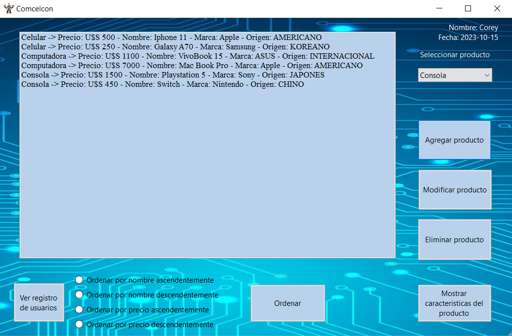
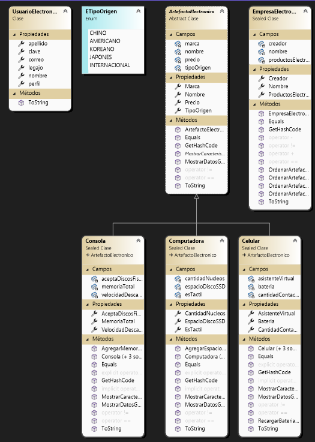

# Presentacion Primer Parcial Laboratorio 2

Me llamo Francisco Martinez Balian, tengo 19 años y aspiro a ser un gran programador. Me emociona mucho la idea de poder ayudar a las personas con la tecnologia, ya sea con un programa, una aplicacion o con un robot para que ayude a las pesonas que tengan ciertas dificultades. Me anote en esta tecnicatura, porque siento que el unico limite es la imaginacion, lo que te imagines es posible si lo sabes programar.

# Titulo: CRUD - Empresa electronica

# Funcionamiento
Este CRUD representa una aplicacion diseñada para una empresa de productos electronicos. Permite agregar, modificar y eliminar distintos elementos electronicos de la lista, y no permite agregar dos productos iguales para evitar confusiones (no pueden tener ni el mismo nombre ni el mismo precio). Ademas, permite ordenar la lista, tanto por sus nombres como por sus precios, tiene un boton para mostrar las caracteristicas especificas de cada producto por si se quiere saber mas de este y por ultimo, contiene un visualizador, para ver un registro de quienes se loguearon.

# Diagrama Esquemático de clases

# Diagrama Esquemático de formularios

